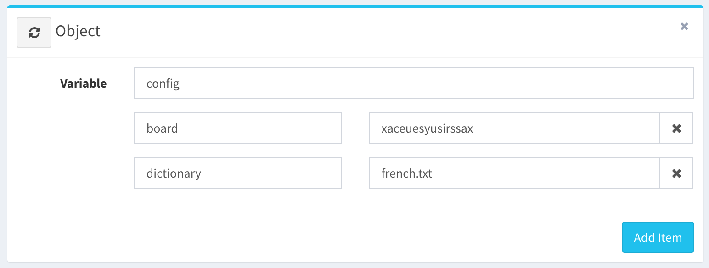
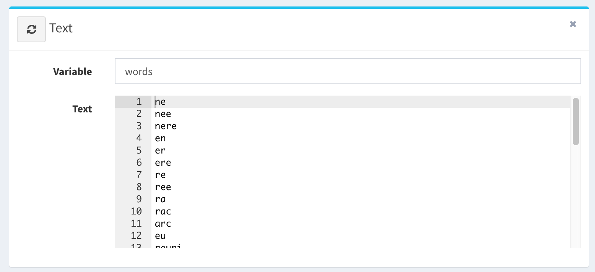

If you know well the facebook game Wordblitz, then you can easily beat your opponent.

Here we created a public flow https://uniflow.io/public/feed/wordblitz-solver

The purpose of this flow is to solve find lots of words in restricted time that are contains into the 4x4 letter grid as show below :

When the game appear, you have to type into the config.board Object item all raw 16 letters as follow :

You choose your dictionary that match you language, here is ‘french.txt’

Then click on play button to run the flow.

It just take few instant and the result of the flow will be found into the last Text item :

Now, you can match all word found into the real game and score to the victory. 🎉
