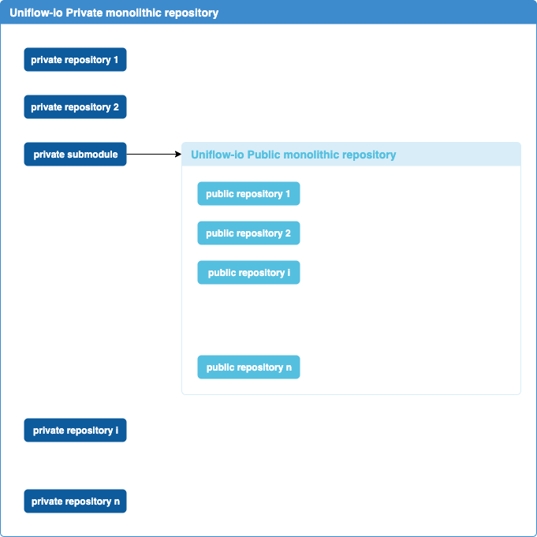

At Uniflow, there is an issue about how we manage our sources repositories.

As a fact, we use **Git** for versioning the repositories as git is largely adopted, there is no reason to replace that tool over time.

The purpose here is : do we use **monolithic repository** or **multiple standalone repository** ?

There is a great article https://blog.shopsys.com/how-to-maintain-multiple-git-repositories-with-ease-61a5e17152e0 that presents the **pro** and the **con** of both usages.

What we choose for now is **monolithic repository** as the projet grow fast and we got multiple dependencies along all sub repositories and all public contributions will be centralized to https://github.com/uniflow-io/uniflow.

But the issue when using **monolithic repository** is the fact that you want have both **Public** and **Private** repositories.

The solution we found is to combine **monolithic repository** AND **multiple standalone repository** in a quite simple way. So we got :
- one Public monolithic repository
- one Private monolithic repository that have one git submodule to the public monolithic repository.

Here is a scheme to get the idea :

This process can change by the time, but it’s now what we use. If you have suggestion, we will be glad to share !
