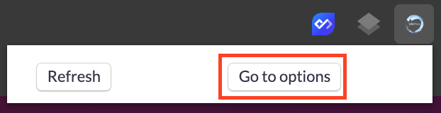
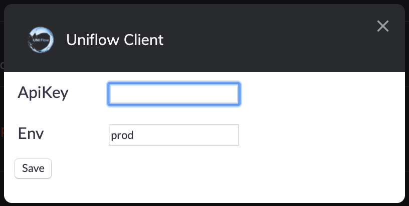
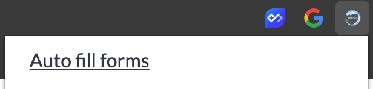

Sometimes, when you are web developing your sites, you need data generation.

Here we will generate data for forms, by using [Chrome Client](https://uniflow.io/library/uniflow-io-chrome-client).

First, you have to install the chrome extension on [Google Chrome web store](https://chrome.google.com/webstore/detail/uniflow-client/addfkelofconemofddhmmdgdiolnhppl)

When the extension is installed, you will need to configure `ApiKey` that you will find on the preferences of the extension.

Then you setup your `ApiKey` that you can find on [Settings](https://uniflow.io/settings)

You can copy [https://uniflow.io/public/feed/auto-fill-forms](https://uniflow.io/public/feed/auto-fill-forms) on your workspace. Then go for instance on [https://google.com](https://www.google.com)
You now see that you can auto-fill forms on Uniflow Chrome extension.

All form fields are now filled !

Have fun 🎉
